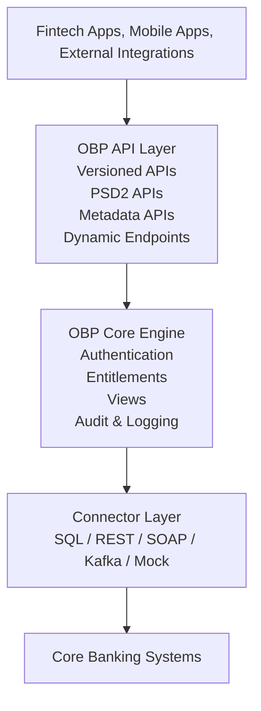
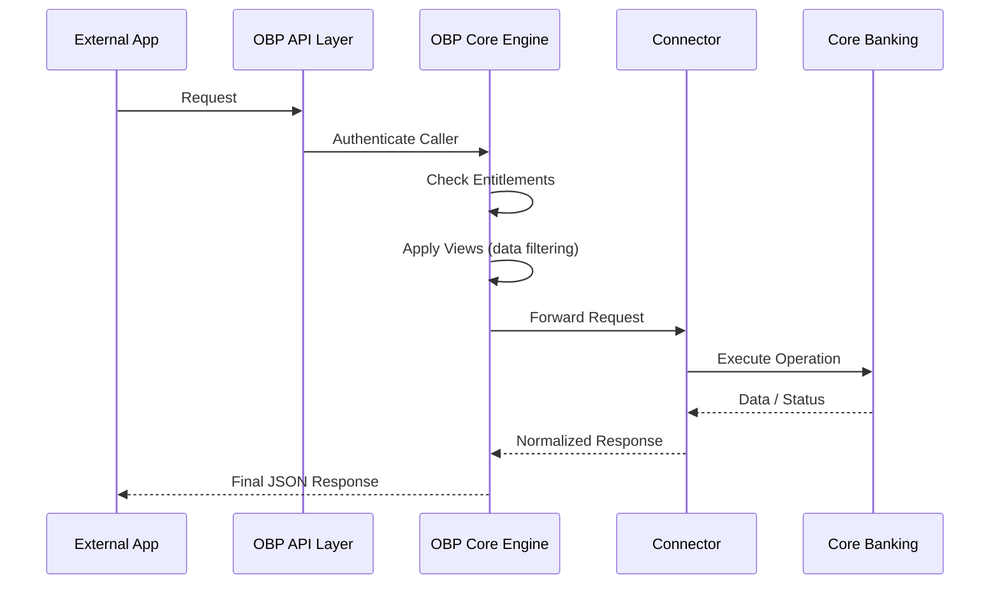

# **Open Bank Project (OBP) Overview**

## The Problem: Why a Fintech App Needs Something Like OBP

Imagine you’re asked to build a modern financial application—let’s call it **FlowTrack**—whose
purpose is to give customers a unified view of all their finances across every bank they use. On the
surface, the idea feels straightforward: you need to retrieve account lists, fetch balances, collect
recent transactions, and help customers see their complete financial picture. But the moment you
begin exploring how to connect to real banks, the technical landscape quickly becomes far more
challenging than you expect.

Each bank has evolved its systems independently over the past several decades. One bank might expose
a REST API with JSON structures that make immediate sense to a developer. Another may still operate
through SOAP services defined years ago. Yet another might not expose any public interface at all,
relying instead on proprietary internal protocols or even older mainframe interactions. There is no
consistency in how accounts are represented, how transactions are formatted, which authentication
systems are used, or what error codes mean. Even the basic question “How do I log a user in?” has
different answers for every institution.

More importantly, banks historically **never** allowed external applications to access customer
data. All early financial tools relied on brittle techniques like screen scraping, where apps logged
into online banking portals using the customer’s username and password—practices that are now widely
considered insecure, unreliable, and in many regions illegal. The underlying systems were not
designed for third-party access. They were not designed for sharing data. They were built for
internal staff using internal interfaces, and connecting to them required arcane, bespoke
integration work.

This situation began to shift with the introduction of **Open Banking** regulations such as **PSD2**
in Europe. These regulations established a principle that fundamentally changed the industry: *
*customers must have the right to authorize third-party applications to access their financial data.
** To comply, banks were required to expose standardized APIs for reading account information,
retrieving transactions, and initiating payments. They were also required to authenticate users with
strong security, record every access event, and allow customers to grant and revoke access at will.

Although this regulatory push solved the legal and business problems, it created a new technical
problem: banks now needed a consistent, audited, permissioned API gateway capable of mediating
access between highly sensitive internal banking systems and a broad ecosystem of external
applications. Most banks lacked the engineering capability to build such a system from scratch,
especially given the unique combination of compliance, security, flexibility, and backward
compatibility required.

This is the gap filled by the **Open Bank Project (OBP)**. OBP provides a standardized API layer,
backed by a sophisticated permission system, strong authentication, audit readiness, and connectors
that translate modern REST calls into whatever backend systems the bank actually uses. It
effectively becomes the translation layer between the world of modern fintech and the often
decades-old systems inside banks. It gives developers a predictable interface, gives banks a
compliant and secure gateway, and gives customers a safe way to authorize applications like
FlowTrack to access their financial lives.

## The Architecture of OBP

At a conceptual level, OBP sits between two worlds: the dynamic, fast-moving ecosystem of external
apps, and the deeply entrenched, highly regulated systems inside a bank. You can think of OBP as a
controlled aperture—a carefully engineered opening—that allows data to pass safely from the inside
out and from the outside in.

Here is the architecture at a high level:

A developer’s first point of contact is always the **API layer**, which exposes versioned REST APIs
under paths like `/obp/v6.0.0/...`. This layer contains the fundamental operations needed by fintech
applications: listing accounts, retrieving transactions, initiating payments, and working with
customer information. Alongside the versioned APIs, OBP includes regulatory interfaces such as the
PSD2 Account Information Service (AIS) and Payment Initiation Service (PIS) endpoints. OBP also
supports metadata APIs for attaching comments or tags to transactions, as well as a dynamic endpoint
system that allows new APIs to be defined without modifying the core codebase.

Behind the API layer lies OBP’s **core engine**, which performs the critical responsibility of
determining what an application can do and what data it is allowed to see. This is managed through
two complementary mechanisms. The first is **authentication**, which establishes the identity of the
user and the client application through DirectLogin or OAuth-based flows. The second is a
combination of **entitlements** and **views**. Entitlements determine whether a user or application
is authorized to call a given endpoint—effectively answering the question: *Is this operation
allowed?* Views, on the other hand, control what fields within the returned data the caller is
allowed to see. Two users calling the same endpoint may receive different subsets of a response
depending on the view applied. These filters allow OBP to enforce the fine-grained data visibility
required by banks and regulators.

Once the request passes through authentication, entitlement checks, and view filtering, it must be
fulfilled. But OBP does not typically store real customer balances or transactions internally.
Instead, it delegates to a **connector**—an adapter that translates OBP’s standardized API calls
into the bank’s internal system conventions. Depending on the bank, this connector might speak SQL,
REST, SOAP, or even Kafka streams. Some institutions implement mock connectors to support sandboxes
or innovation programs. The connector retrieves the necessary information or executes the requested
action and returns it to the core engine, which applies the final transformations before sending the
response back to the client.

The full lifecycle can be illustrated as follows:

This layered approach allows banks to modernize their API surface without restructuring their
internal systems. It allows developers to work with predictable, human-friendly APIs even when the
underlying banking systems are decades old.

## How a Real Application Uses OBP

Returning to our hypothetical fintech app **FlowTrack**, we can now see how OBP provides the
infrastructure needed to make multi-bank interactions feasible. The user experience begins when
FlowTrack asks the customer to connect their accounts. Instead of handling login credentials
directly—which is forbidden—FlowTrack redirects the user to their bank. The bank authenticates the
user, prompts them to grant consent, and issues a token that FlowTrack can use to call OBP’s APIs.

With this token, FlowTrack can request the list of accounts associated with the customer. OBP
receives the request, verifies authorization, checks whether FlowTrack is entitled to call the
endpoint, applies the user’s view to filter visible fields, and finally uses the connector to
retrieve account data from the bank’s core system. FlowTrack receives a standardized JSON response
regardless of how the bank stores or represents the data internally.

Next, FlowTrack may request recent transactions for each account. OBP again enforces permissions and
views before calling the connector. The filtering is essential: different banks—and even different
account owners—may expose different fields to the same client. Some institutions permit full
transaction details; others mask merchant names or omit reference codes. OBP ensures FlowTrack
receives only what the user is authorized to see.

Beyond reading data, FlowTrack may allow the user to add notes or tags to transactions. These
requests are handled entirely within OBP’s metadata subsystem and do not touch the bank’s core
system. If the app supports bill payments or money transfers, it can initiate payments through OBP’s
PSD2 Payment Initiation APIs, triggering strong customer authentication before the connector
executes the payment.

Through OBP, FlowTrack interacts with a single, consistent API surface—no matter how many banks the
user holds accounts with, and no matter how those banks internally store or process financial data.
The complexity is absorbed by OBP, not FlowTrack.

## Why OBP Is an Ideal Sandbox for AI Agent Architectures

When building AI agents for financial workflows, the biggest challenge is finding a realistic
environment to test them in. Agents need more than static JSON—they need authentication flows,
multi-step tasks, permissions that fail, and data structures rich enough to force real decisions. A
simple mock API doesn’t create that kind of pressure.

This is where the Open Bank Project becomes an unexpectedly powerful playground.

The open-source edition runs locally through Docker Compose and comes preloaded with **dummy
accounts, transactions, permissions, roles, and views**. It behaves exactly like a real open banking
system—just without the risk. An agent must authenticate, navigate entitlements, handle missing
fields, choose appropriate endpoints, and adapt to the same multi-step patterns used in real
financial integrations.

Because OBP is deterministic and fully reproducible, it’s easy to run experiments, compare agent
strategies, and evaluate different architectures—function-calling agents, graph-based planners,
memory-augmented loops, or reflective agents. You can replay scenarios, measure correctness, and
refine behaviors without touching a real bank or using real data.

In short, OBP provides the structure, complexity, and safety needed to prototype financial agents
responsibly. It offers just enough realism to shape intelligent behavior, yet remains lightweight
enough to run on any developer machine—a rare combination and a highly effective testing ground.

## Authentication in OBP

Financial applications exist on a spectrum. At one end, you have user-facing mobile apps where a
real person logs in, authorizes access to their account, and expects the session to persist across
app launches. At the other end, you have backend gateway systems that run autonomously, translating
requests from a core banking system into OBP calls without any human in the loop. In between, you
have internal tools, prototypes, testing harnesses, and third-party integrations—each with its own
security requirements and workflow constraints.

A strict OAuth flow makes perfect sense for the mobile app: the user explicitly grants permission,
the app receives a token representing that grant, and the bank can revoke access if something goes
wrong. But that same OAuth flow becomes an obstacle when you're building a backend adapter that
needs to run unattended. Meanwhile, a developer spinning up OBP for the first time just wants to
make a test call to see what the API returns—they don't want to navigate certificate exchanges or
redirect URIs before they've even confirmed the system works.

OBP's answer is pragmatic: it offers **three primary authentication methods** (plus legacy OAuth 1.0a
support), each tuned for a different scenario. Rather than forcing every integration into the same
mold, OBP lets you pick the authentication model that fits your architecture. The trade-off is that
you need to understand what each method does and why it exists.

### DirectLogin: Simplified Development

**DirectLogin** is built for speed. Exchange a username, password, and consumer key for a token in a single API call to `/my/logins/direct`. No redirect flows, no callbacks—just credentials in, token out. Use that token in the `Authorization` header for all subsequent requests.

This makes DirectLogin ideal for **internal tools** and **development environments** where you're iterating quickly. You do need a consumer key first (create one via the web UI at `/consumer-registration` or use GatewayLogin), but once you have it, DirectLogin is your fastest path to authenticated API calls.

The trade-off: you're sending credentials directly and the token is long-lived. Fine for sandbox environments and internal tools, but user-facing apps should prefer OAuth 2.0's delegated access model.

### GatewayLogin: System Integration Without Users

**GatewayLogin** is for server-to-server integration where no human is involved. Create a JWT containing your system's app ID, app name, and username, sign it with a shared secret, then send it to OBP in the `Authorization: GatewayLogin token="<jwt>"` header.

The key difference: OBP **automatically creates or retrieves a consumer** based on the app ID in the JWT. No pre-registration needed, no web forms—the consumer is created dynamically from the JWT payload. This solves the bootstrap problem elegantly.

Use GatewayLogin for core banking adapters, payment gateways, or any backend system calling OBP autonomously. Security relies on keeping the JWT signing secret confidential between your system and OBP.

### OAuth 2.0 and OpenID Connect: Modern Web Authentication

**OAuth 2.0 with OpenID Connect** is the industry standard for user-facing web and mobile apps. If you've clicked "Sign in with Google" on a website, you've used this flow. Your app redirects users to an identity provider (Google, Keycloak, Azure AD, etc.), they log in and grant permission, and the provider issues a token. Your app sends that token to OBP using `Authorization: Bearer <token>`.

The advantages: offload authentication to specialized providers that handle passwords, MFA, and account recovery. Integrate seamlessly with enterprise identity systems. Use industry-standard bearer tokens.

The trade-off: you need an identity provider already running. For quick prototypes, this adds complexity. But for production apps serving real customers, OAuth 2.0 / OpenID Connect is the right choice.

### Choosing the Right Authentication Method

The decision comes down to your integration pattern:

- **User-facing web/mobile apps** → **OAuth 2.0 with OpenID Connect**. Industry-standard, secure, integrates with existing identity providers.

- **Backend systems** (adapters, gateways, microservices) → **GatewayLogin**. Solves the bootstrap problem, no user interaction needed.

- **Rapid prototyping, internal tools, development** → **DirectLogin**. Fastest path from credentials to working code.

### The Bootstrap Problem

One recurring challenge deserves special mention: the bootstrap problem. Most authentication methods
require a consumer key, but how do you get your first consumer key? The web UI provides a
registration form at `/consumer-registration`, where you can log in as a super admin (using
credentials configured in the OBP properties file) and manually create a consumer. This works, but
it introduces a manual step into what should be an automated process.

For most developers, the pragmatic path is to create one bootstrap consumer manually through the web
UI, store its credentials securely, and use that consumer for all subsequent automation—including
programmatic creation of additional consumers via the management APIs. It's a one-time manual step
that unlocks fully automated workflows afterward.

